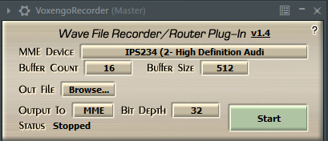
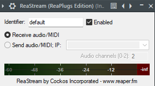
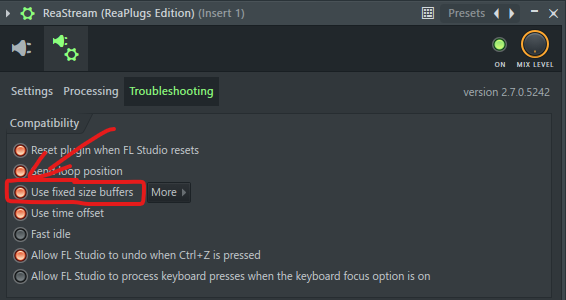

# ReaStream Bridge

Gets desktop audio (Spotify, YouTube, Discord, etc) into your DAW over UDP using the [ReaStream](https://www.reaper.fm/reaplugs/) protocol. Fixes the WDM/ASIO clock drift crackling that VSTHost and Cantabile can't deal with.

Works with any DAW that loads VSTs: FL Studio, Reaper, Ableton, Cubase, Bitwig, etc.

```
Spotify/Discord/etc → VB-Cable → [ReaStream Bridge] → UDP → Your DAW
```

## Why

I wanted to play live drums for friends over Discord screenshare with Spotify playing along in sync. Tried Cantabile, VSTHost, every other solution I could find, they all crackle eventually because ASIO and WDM clocks drift apart. So I vibe coded this.

DAWs use ASIO (hardware clock), desktop apps use WASAPI/WDM (Windows clock). Over time these drift and you get crackling. This bridge captures from VB-Cable in WASAPI exclusive mode, sits on a 2-second buffer, and runs a PI controller to keep it centered at 50% fill so the drift gets absorbed instead of crackling.

## Discord screenshare setup

The full use case: you want ASIO for low-latency instrument monitoring, but you also want Spotify/YouTube playing inside your DAW so when you screenshare on Discord, viewers hear your instruments and music together.

```
Spotify → VB-Cable → [ReaStream Bridge] → UDP → DAW mixer (ReaStream receive)
                                                      ↓
Guitar/Mic → Audio Interface (ASIO) ──────────→ DAW mixer
                                                      ↓
                                              DAW master out → ASIO → headphones
                                                      ↓
                                              Voxengo Recorder → MME device
                                                                    ↓
                                                Discord screenshare picks up MME device audio
```

Instruments stay on ASIO with no added latency. Spotify comes through the bridge about 2 seconds behind, but Discord viewers don't notice since they hear everything from the same output.

To get Discord to actually hear audio from your DAW window, you need [Voxengo Recorder](https://www.voxengo.com/product/recorder/) (free VST). It copies your DAW's master output to an MME device, and Discord can capture that when you screenshare.



Install it, put it on your master bus, set Output To to MME, and pick any MME device you're not listening through (disabled onboard audio, a second VB-Cable, doesn't matter). Set Bit Depth to 32, Buffer Count 16, Buffer Size 512, hit Start. Then screenshare the DAW window on Discord.

## Setup

You need [VB-Cable](https://vb-audio.com/Cable/) (free virtual audio cable), [ReaPlugs VST](https://www.reaper.fm/reaplugs/) (has the ReaStream plugin), and Python 3.10+.

```
pip install -r requirements.txt
```

Set VB-Cable's sample rate to 44100 Hz in Windows Sound Settings (both Playback "CABLE Input" and Recording "CABLE Output" under Properties → Advanced).

Then you need to route Spotify (or whatever app you want audio from) to VB-Cable. Go to Windows Settings → System → Sound → Volume mixer (or just search "volume mixer" in Start). Find Spotify in the app list and change its output device to "CABLE Input (VB-Cable)". You can do this per-app so only Spotify goes through VB-Cable while everything else stays on your normal speakers/headphones.

In your DAW, make sure the sample rate is 44100 Hz (has to match VB-Cable). Install [ReaPlugs](https://www.reaper.fm/reaplugs/), throw ReaStream on any mixer channel, set it to Receive audio/MIDI, tick Enabled, leave the identifier as `default`.



If you're on FL Studio, you also need to open the ReaStream plugin window, click the gear icon (wrapper settings), go to the Troubleshooting tab, and turn on "Use fixed size buffers". FL sends variable-length blocks by default and ReaStream drops UDP packets because of it. Other DAWs don't need this.



### The `default` identifier

ReaStream matches senders and receivers by a text identifier. Both sides need the same string. This bridge uses `default`, same as ReaStream's own default. Change it with `--reastream-id something` if you need to.

### Running it

Double-click `reastream_bridge.py` or run from command line:

```
python reastream_bridge.py -d auto              # auto-detect VB-Cable
python reastream_bridge.py --list               # list audio devices
python reastream_bridge.py -d auto --test-tone  # 440 Hz sine to test the chain
python reastream_bridge.py -d auto -r 48000     # if your DAW runs at 48k
```

`start_bridge.bat` does the same but checks for Python and installs deps first, useful for first-time setup.

For background operation: `pythonw bridge_tray.pyw` puts a green "R" in the system tray, hover for buffer status, right-click to quit. `install_startup.bat` makes it run on login, `remove_startup.bat` undoes that.

## WASAPI modes

The bridge tries WASAPI exclusive first (bypasses Windows mixer, direct device access, best mode). VB-Cable's sample rate in Windows settings has to match the `--rate` arg (default 44100). If exclusive fails it falls back to shared + auto_convert, then plain shared, but I haven't tested those.

All modes use `blocksize=0` so PortAudio delivers frames as they come instead of rebuffering into fixed chunks. This avoids the frame-drop issue VSTHost has.

### Flags

| Flag | Default | |
|------|---------|--|
| `-b` | `2.0` | Buffer size in seconds |
| `--send-block` | `512` | Frames per send cycle (512 @ 44100 Hz ≈ 11.6ms) |
| `-r` | `44100` | Sample rate, match VB-Cable and your DAW |
| `--ip` | `127.0.0.1` | Target IP, change for network streaming |
| `-p` | `58710` | UDP port |

### Debug

`python reastream_bridge.py --sniff` listens for incoming ReaStream packets. Stats print every 5 seconds showing buffer fill, capture/output rate, PI correction, and underruns. If correction drifts far from 1.00000, your sample rates don't match somewhere.

## Wire format

ReaStream UDP packets (reverse-engineered):

```
Offset  Type        Field
0       char[4]     Magic "MRSR"
4       uint32      Packet size (header + audio)
8       char[32]    Identifier (null-padded ASCII)
40      uint8       Channels
41      uint32      Sample rate
45      uint16      Audio byte count
47      float32[]   Audio data (non-interleaved: all ch0 samples, then all ch1)
```

## Custom ReaStream Receiver VST (for ultra-low buffer sizes)

The Cockos ReaStream receiver VST works fine at buffer sizes of 64+, but if you run your ASIO buffer at 32 or lower (for live drums, guitar, etc), it crackles. This is because the original plugin does UDP socket I/O directly inside the audio callback — at buffer size 8 on a 44.1k session, `processBlock` runs every 0.18ms and there's no room for a `recvfrom()` syscall to complete without missing a deadline.

The `ReaStreamReceiver/` folder contains a custom JUCE VST3 that fixes this. It's a drop-in replacement that speaks the same ReaStream protocol on the same port.

**What's different:**

| | Cockos ReaStream | This receiver |
|---|---|---|
| Network I/O | Inside `processBlock` (audio thread) | Dedicated high-priority thread |
| Buffering | Fixed internal buffer | Lock-free SPSC ring buffer with configurable jitter buffer |
| `processBlock` work | Socket read + parse + buffer + output | One `memcpy` from ring buffer |
| Buffer size 8 | Crackles | Clean |

The network thread runs a tight `recvfrom()` loop and pushes parsed audio into a lock-free ring buffer. The audio thread just reads N samples out — no syscalls, no locks, no allocations. A 4ms jitter buffer absorbs UDP timing variance.

### Building

You need [JUCE](https://github.com/juce-framework/JUCE) and Visual Studio Build Tools (MSVC — JUCE doesn't support MinGW).

```bash
cd ReaStreamReceiver
cmake -B build -G Ninja -DJUCE_DIR=C:/JUCE -DCMAKE_BUILD_TYPE=Release
cmake --build build --config Release
```

Or just run `build_vst.bat` if you have VS2022 Build Tools installed — it sets up the MSVC environment and builds everything. The VST3 gets auto-installed to `C:\Program Files\Common Files\VST3\`.

### Using it

Rescan plugins in your DAW, drop **"ReaStream Receiver"** on a mixer track instead of the Cockos ReaStream. Same protocol, same port (58710), same `default` identifier. The bridge script doesn't need any changes.

The plugin shows a small status panel with buffer fill, packet count, underruns, and sample rate. If underruns stay at 0, you're good.

## Related problems this fixes

If you got here by googling one of these, you're in the right place:

- Spotify crackling in FL Studio when using ASIO
- VSTHost or Cantabile audio popping/crackling over time
- How to route desktop audio into a DAW without clock drift
- Playing along to Spotify with ASIO and it sounds fine at first but starts crackling after a few minutes
- Discord screenshare not picking up DAW audio
- VB-Cable to FL Studio crackling
- WASAPI/WDM and ASIO clock drift problem
- How to get Spotify/YouTube/Discord audio into FL Studio/Reaper/Ableton
- ReaStream crackling at low buffer sizes
- ReaStream popping at buffer size 32 or lower
- Custom ReaStream receiver VST for low latency

## License

MIT
